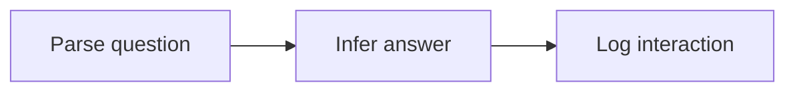

# Semantic Campus Locations

## Objective

Given an SUTD room name or address, return the corresponding SUTD room address or name.

## Data

Let `<` be a beginning-of-sequence (BOS) token,
and `>` be an end-of-sequence (EOS) token,
and `n` denote a name,
and `N` denote a list of names.
and `a` denote an address,
and `A` denote a list of addresses.

1. Scrape HTML into raw dataset from [Getting around SUTD](https://sutd.edu.sg/contact-us/getting-around-sutd) using a polite web scraper.
2. Convert raw dataset into an edge dataset by writing each name and address canonically.
3. Convert edge dataset into pre-training datasets `names.txt`, `addresses.txt`, and fine-tuning datasets `n2a.txt`, `a2n.txt`:
  - `names.txt` contains rows of names.
  - `addresses.txt` contains rows of addresses.
  - `n2a.txt` contains rows of `n<A>`.
  - `a2n.txt` contains rows of `a<N>`.

## Architecture

Transformer.

## Loss

Cross-entropy.
