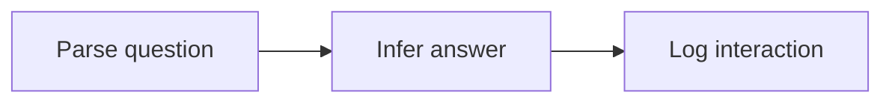

# mlops

## Objective
Given an SUTD room name or address, return the corresponding SUTD room address or name at low latency using a language model.

## Data
[Getting around SUTD](https://sutd.edu.sg/contact-us/getting-around-sutd).
1. Scrape.
2. Standardise.
3. Augment.

### Pre-training
- `names.txt`: Rows of names.
- `addresses.txt`: Rows of addresses.

### Fine-tuning
Let `<` be a beginning-of-sequence (BOS) token, and `>` be an end-of-sequence (EOS) token.
- `n2a.txt`: Rows of `n<A>`, where `n` is a name, and `A` is a list of addresses.
- `a2n.txt`: Rows of `a<N>`, where `a` is an address, and `N` is a list of names.

## Architecture
Transformer.

## Loss
Cross-entropy.
